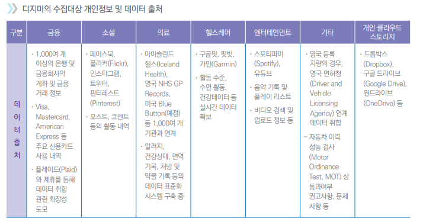
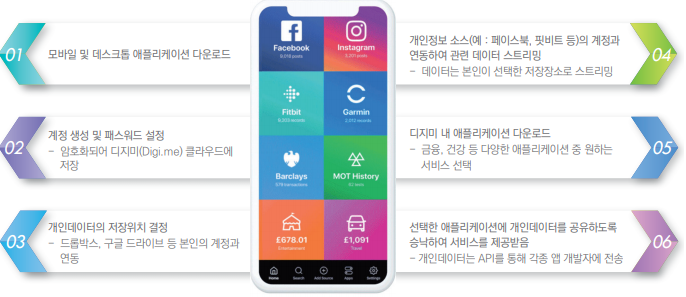
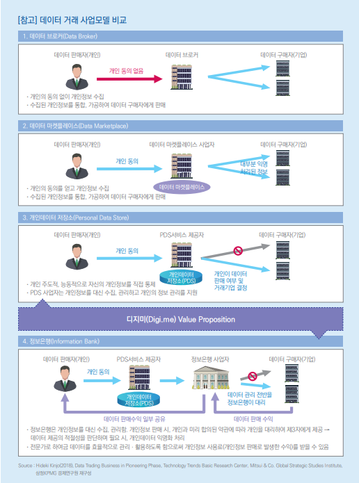
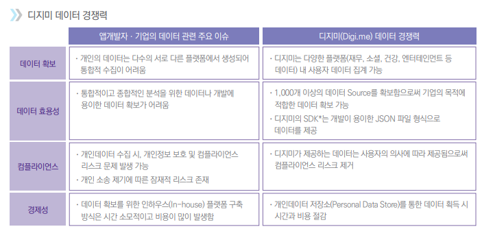

# 디지미 : 정보 보호에 기반한 개인데이터 공유 플랫폼

  영국에서 설립된 **개인 데이터 저장소(Personal Data Store, PDS)** 사업자다. 개인의 정보를 단일 플랫폼에서 수집, 관리, 활용할 수 있는 통합 플랫폼을 표방하고 있다. 디지미와 같은 **PDS**는 개인정보를 수집하고 유통회사나 금융회사 등 다른 기업에 해당 데이터를 제공하여 수익을 창출한다는 점에서 데이터 브로커와 비슷하다. 개인의 의지와 상관없이 온라인상 개인정보를 무작위로 방대하게 수집하는 데이터 브로커와 달리, **PDS**는 제 3자에 대한 개인정보 제공 여부를 정보주체인 **개인 스스로**가 결정한다는 점에서 차이가 있다.

## 1. 사용자 중심으로 광범위한 데이터를 한 곳에서 통합 관리

  디지미가 수집하는 개인정보는 크게 금융, 소셜, 의료, 헬스케어, 엔터테인먼트 정보로 구분된다. 금융정보의 경우, 디지미는 금융회사의 계좌 정보를 제공하는 미국 핀테크 기술 기업인 플레이드와 제휴하여 거래내역을 취합할 수 있다. 비금융정보의 경우 소셜정보는 페이스북, 트위터, 인스타그램 등을 통해 소셜 네트워크 활동 내역을 취합할 수 있다. 건강 정보의 경우, 건강 웨어러블 장치 기업인 핏빗 등을 통해 사용자의 활동 내역, 수면 기록 등을 입수한다.

  사용자의 편의를 극대화하기 위해 디지미 사용방법은 **아주 간단하고 직관적이며**, **사용자 친화적**이다. 디지미를 통해 수집되는 개인데이터에 대한 저장 위치를 선정할 수 있으며 자신의 클라우드 계정에 저장하도록 선택할 수 있다. 사용자가 관리하고자 하는 정보를 디지미를 통해 연계, 취합하고 다양한 앱을 선택하여 자신이 공유한 데이터에 기반하여 서비스를 이용할 수 있다. 사용자는 원하는 서비스를 선택하여 누구에게 어떤 데이터를 제공할지 여부를 모두 스스로 결정할 수 있다.  디지미는 사용자의 권한, 프라이버시를 강화하기 위해 원천적으로 플랫폼 내 모든 개인데이터에 대한 권리를 소비자에게 부여하는 한편, 개인의 데이터를 디지미 플랫폼 내 스토리지 공간이 아닌 사용자 자신의 **개인 클라우드 스토리지에 저장**할 수 있도록 지원함으로써 **사용자 중심의 정보관리 체계**를 구축하였다.

## 2. 데이터와 관련된 플랫폼 비즈니스 모델 시도

  디지미는 데이터 생산자(사용자)와 이를 활용하는 기업 간 데이터 중개자로서 플랫폼 비즈니스를 지향하고 있다. 개인의 입장에서는 디지미는 데이터의 수집부터 저장 및 공유에 이르기까지 개인정보 관리 전 과정을 지원하는 PDS 서비스를 무상으로 제공한다. 

### 디지미 사용방식

  디지미의 데이터는 사용자 동의에 근거하여 데이터를 제공받기 때문에 데이터 브로커들의 데이터보다 품질 및 신뢰성이 우수하다.  또한 사용자에 의해 지속적으로 업데이트 되는 최신 데이터를 안정적으로 확보할 수 있다는 점에서 경쟁력이 높다. 제공받은 데이터를 활용하여 앱을 개발하고 디지미와의 제휴를 통해 디지미 플랫폼 내에서 앱을 상용화할 수 있다.

  디지미는 기업에 제공하는 데이터 트랜젝션 또는 디지미와 연계하여 창출되는 앱 수익의 일정 부분을 수수료로 부과함으로써 수익을 올린다. 디지미는 데이터 생산자와 사용자가 만나 교차 네트워크 효과가 발생할 수 있는 플랫폼이다. 많은 소비자가 유입될수록 이를 활용하고자 하는 기업이 많아진다. 이에 따라 소비자 친화적이며 혁신적인 앱이 개발되고 출시되면 더 많은 수비자가 유입되는 선순환적인 구조를 가지고 있다.

## 3. 데이터 권한 강화에 대응한 새로운 비즈니스 모델

  데이터 사업 모델은 데이터 브로커를 넘어서서 데이터 마켓플레이스, PDS, 정보은행으로 진화중이다. 정보은행은 PDS기능과 더불어 데이터 판매에 대한 보상과 개인데이터의 관리 대행이라는 데이터 신탁 개념까지 포괄한다. 정보은행은 데이터 관리, 활용, 판매 등 개인의 데이터 관리를 대리해준다는 측면에서 해당 기관에 대한 높은 신뢰가 필요하며 개인이 제공한 데이터에 대한 대가로 금전이나 유,무형의 편익 등 경제적 이익을 제공하는 실험적 모델이다.

  디지미는 데이터에 대한 개인의 권한 강화 기조를 반영하여 디지미가 개인 데이터를 열람하거나 수정 또는 저장할 수 없도록 하는 대신 사용자 스스로가 데이터를 수집, 저장, 관리할 수 있는 시스템을 구축하였다. 즉 기존 PDS 대비 개인데이터에 대한 관리 기능은 배제하고 더욱 높은 수준으로 프라이버시를 보호하여 사용자의 신뢰를 얻고 컴플라이언스 리스크를 낮춘것이다.

