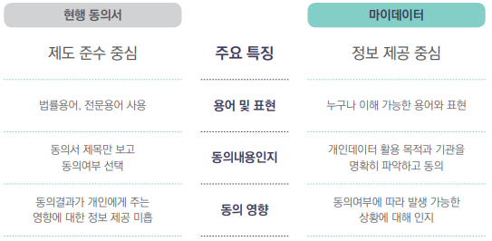
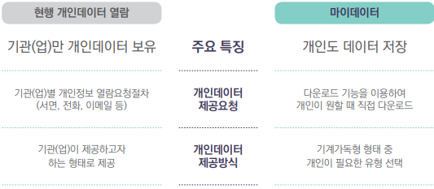
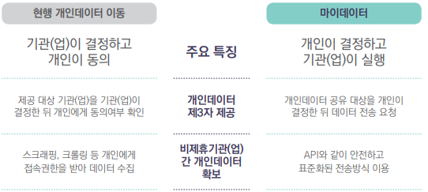
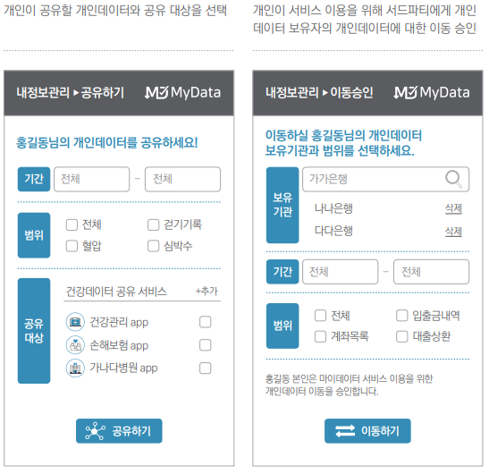

# 마이데이터 서비스 안내서 

## 마이데이터 개념 및 원칙

### 1. 마이데이터 개념

- 개인이 개인데이터의 활용처 및 활용범위 등에 대해 능동적인 의사결정을 하는 개인데이터 관리 및 활용체계의 새로운 패러다임

### 2. 마이데이터 원칙

  마이데이터 원칙은 개인데이터 통제, 제공, 활용이 개인을 중심으로 진행되는 것을 의미한다.

#### 1) 데이터 권한

  개인이 개인데이터의 접근, 이동, 활용 등에 대한 통제권 및 결정권을 가져야한다.

#### 2) 데이터 제공

  개인데이터를 보유한 기관 및 기업은 개인이 요구할 때, 개인데이터를 안전한 환경에서 쉽게 접근하여 이용할 수 있는 형식으로 제공해야 한다.

#### 3) 데이터 활용

  개인의 요청 및 동의에 의한 데이터의 자유로운 이동과 제3자 접근이 가능하여야 하며 그 활용 결과를 개인이 투명하게 알 수 있어야 한다.

### 3. 마이데이터 체크리스트

  

## 마이데이터와 동의

### 동의

 : 개인데이터의 주인인 **개인**이 자신의 데이터를 활용해도 좋다는 승인의사를 표현하는 것으로, 개인 중심의 개인데이터 활용에 대한 허가를 받는 가장 필수적인 절차다.

- 개인정보보호법 등에서도 개인데이터 수집, 이용, 제공 시 개인의 동의를 기반으로 하도록 명시한다.

> **EU 일반 개인정보보호법(GDPR)에서의 동의 의미와 획득 방식**
>
>   GDPR은 개인정보의 보호와 EU 역내에서의 자유로운 이동을 보장하는 것이 목적으로 개정 전보다 정보주체의 권리를 확대 및 강화하였다. 그 중 **동의**는 GDPR의 주요 원칙 중 하나로 정보주체의 통제권과 선택권을 보장하기 위해 개정 전보다 강화된 동의 조건을 제시하고 있다.
>
> 
>
> - **동의**란?
>
>   : 정보주체가 진술하거나 적극적인 행동을 통해 자신의 개인정보처리에 대한 긍정적인 의사를 표현하는 것
>
> - 유효한 **동의**의 조건
>
>   - 자유롭게 부여된 동의 : 정보주체에게 강압이나 불이익에 대한 두려움이 없는 상태로 동의에 대한 선택권이 주어져야 하며, 컨트롤러는 정보주체가 불이익 없이 동의를 거부하거나 철회할 수 있다는 것을 입증해야 한다.
>
>   - 개별적으로 특정한 동의 : 개인정보 처리 목적을 사전에 명확하게 정의하고 여러 개의 목적에 대해 각각에 대한 정보를 분리하여 제공한 뒤 개별적인 동의를 받아야 한다.
>
>   - 사전정보가 제공된 동의 : 정보주체의 의사결정에 도움을 줄 수 있도록 동의의 의미, 영향에 대한 정보를 제공해야 하며 정보 제공시 일반인이 이해할 수 있고 누구나 접근 가능한 형태로 제시되어야 한다.
>
>   - 정보주체의 명확한 의사 표시 : 동의는 개인정보 처리 전 획득해야 하며 다음과 같은 명확한 긍적적인 행위가 있어야 한다.
>
>     > 불인정 사례 : 사전에 선택된 체크박스 제시, 암묵적 동의, 이용약관에 포괄적 수용 의사 표시 등..
>
> - **명시적 동의**
>
>   - 정보주체가 서면진술, 동의 의사가 표명된 이메일 발송, 정보주체의 서명이 포함된 문서의 스캔본 업로드, 전자서명, 동의에 대한 2단계 검증을 통해 명확한 의사 표시를 한다.
>   - 민감정보처리, 역외 이전 시 특정 사항에 대한 예외 조항, 프로파일링을 포함한 자동화된 의사결정 등에 해당하는 경우 명시적 동의가 필요하다.
>
> - **동의 철회**
>
>   : 컨트롤러는 정보주체가 동의를 획득한 행위와 동일한 방식으로 언제든지 동의를 철회할 수 있어야 한다.

## 마이데이터와 열람권

- 개인은 정보주체의 권리 중 하나로 기관, 기업이 보유하고 있는 개인데이터와 처리정보에 대한 열람 및 사본을 요청할 수 있는 열람권을 가진다.

- 개인정보보호법, 정보통신망법, 신용정보법, 읠법에 모두 열람권이 보장되어 있으며, 개인의 열람 요청 시 특별한 사유가 없는 한 기관, 기업들은 정해진 기간 내에 관련 정보를 제공해야 한다.

  > **마이데이터 열람권**
  >
  > : 기관, 기업이 보유한 개인데이터와 처리내역을 개인이 조회하고 사본을 제공받을 수 있는 권리가 법으로 보장되어 있으며 본 권리를 근거로 자신의 데이터를 확보하여 마이데이터 서비스 제공자에게 개인데이터를 제공할 수 있다.

- 열람권은 이동권 법제화와 별도로 현행법 내에서 개인의 의지에 따라 개인데이터를 본인이 원하는 서비스에서 활용할 수 있는 제도적 근거다.

- 열람은 할 수 있으나 개인데이터를 전자파일로 제공해야 한다는 조항이 없어서 실효성이 낮아 열람권 현실화 및 활성화가 필요하다.

- 개인은 열람권을 직접 혹은 대리인을 통하여 행사할 수 있다.

    

  > **해외 열람권 보장 제도**
  >
  > - **GDPR(EU)** : 열람권을 통해 정보주체가 자신의 개인정보 처리 사실을 확인하고 자신의 개인정보에 대한 접근을 요구할 수 있는 권리를 보장한다.
  >
  >   - 열람 요구 시 1개월 이내에 사본을 무료로 제공해야 하며, 정보 주체의 요구가 전자적인 형태로 이루어지면 일반적으로 이용할 수 있는 전자적 형태로 제공한ㄷ.
  >   - 정보주체가 원거리에서도 개인정보에 접근할 수 있는 시스템 등의 방법을 권고한다.
  >
  >   
  >
  > - **스마트공시(미국)** : 개인데이터를 쉽게 접근하고 다운로드할 수 있는 서비스를 제공한다(2011. 09)
  >
  >   - 스마트공시 대상 중 소비자에 대한 개인데이터가 포함되어 있으며 이 경우, 정보주체인 개인이 선택한 대상에게만 안전한 방식으로 제공하도록 지원한다.
  >   - 헬스케어, 교육, 금융, 통신 등의 분야에서 실행되고 있으며 건강보험이동 및 책임법은 자신의 진료기록을 요청하는 환자에게 전자사본 제공을 의무화한다.

## 개인의 권리

- 마이데이터 환경은 개인을 중심으로 개인데이터의 관리와 활용이 실행되고, 이 과정에서 개인은 데이터의 주인으로서 권리를 갖는다.
- 서비스를 제공하는 것은 기관 및 기업이지만 개인데이터가 수집, 활용되는 과정은 개인의 의사결정에서부터 시작되며, 개인데이터를 어떻게 이용했는지 개인이 알 수 있도록 투명하게 공개되어야 한다.
- 마이데이터 서비스 이용 시, 개인의 권리는 다음과 같다.

 

- 개인이 자신의 권리를 인지하고 기관 및 기업에 요구 시 원활한 대처가 가능하도록 제도정비 및 정부 차원의 계도가 병행되어야 한다.

  

## 마이데이터 서비스

### 마이데이터 서비스 특징

- 마이데이터의 개념적인 의미와 원칙은 서비스를 통해 실체를 가지며, 개인들도 서비스를 통해 달라진 개인데이터 패러다임 경험이 가능하다.

  - 마이데이터 서비스는 개인데이터의 제공자이자 서비스의 사용자인 개인을 중심으로 구현되어야 하며, 개인데이터의 수집 및 이용뿐 아니라 서비스를 통해 제공되는 과정과 결과에 대해서도 개인이 이해할 수 있어야 한다.

- 마이데이터 서비스 특징

    

  - 투명성 : 개인이 기관 및 기업에게 기만당하거나 착취당했다는 오해를 하지 않도록 수집 / 활용 정보 공개
    - 예) 개인데이터 열람 및 조회, 다운로드, 데이터 처리내역 제공
  - 신뢰성 : 개인데이터 보호체계 마련 및 개인데이터 활용과 서비스 제공 과정에서 마이데이터 서비스 제공자를 신뢰할 수 있는 방안 제시
    - 예) 맞춤형 상품 추천시 개인이 이해할 수 있는 방식으로 추천의 근거 제시
  - 통제권 : 동의를 통한 통제권 행사 및 개인이 원하는 제3자를 선택하여 개인데이터 공유
    - 예) 선별적 동의 및 쉬운 동의 변경, 제3자 공유
  - 가치 : 개인을 포함한 수익모델 및 개인에게 명확하고 가시적인 보상 제공
    - 예) 개인데이터 활용을 통해 발생하는 수익 중 일부를 개인에게 환원, 개인에게 제공된 혜택을 가시적으로 제시

### 공통 요구사항

- 마이데이터 서비스를 마이데이터답게 만들기 위한 방안으로 **공통 요구사항** 적용을 권고한다.

  - 공통요구사항은 개인의 자기정보결정권을 보장하고 개인데이터가 원활하게 흐르는 생태계를 조성하기 위한 최소한의 장치다.
  - 개인데이터를 어떻게 활용할 것이냐 이전에 서비스 기획단계부터 **공통 요구사항** 적용 방안을 함께 고려하는 접근법으로 전환한다.

- **공통 요구사항**은 동의, 제공, 이용내역관리 등 개인데이터 활용 프로세스별로 제시한다.

    

  

### 서비스 기본 모델

- 마이데이터 서비스 모델은 이해관계자간 개인데이터의 흐름과 공통요구사항을 포함한다.

- 개인데이터 제공과 활용은 역할을 의미하는 것으로 하나의 기관 및 기업이 제공과 활용의 역할을 모두 수행할 수 있다.

- 마이데이터 서비스 기본 모델

    

  - 개인 : 마이데이터 서비스를 이용하는 당사자로 개인데이터로 식별이 가능하고 해당 개인데이터의 주체이면서 통제권을 가진 사람이다.
  - 개인데이터 보유자 : 마이데이터 서비스 제공자가 활용하는 개인데이터를 보유하고 있는 기관 및 기업이다.
  - 마이데이터 서비스 제공자 : 개인데이터를 수집 및 이용하여 마이데이터 서비스를 제공하는 모든 개인, 기업, 기관이다.

- 마이데이터 서비스 제공자를 중심으로 한 모델 예시

 

## 공통요구사항 적용 방안

### 공통요구사항별 주요내용

 

### 알고하는 동의

 : 마이데이터 서비스 이용자가 **개인데이터 활용에 대한 정보를 인지한 상태**에서 서비스를 이요할 수 있도록 **정보가 충분한 동의서**를 구성하는 것이 중요하다.

- **핵심내용고지** : 동의서별 제목만 보고 선택하지 않도록 핵심내용을 요약하여 제시
- **직관적 표현** : 개인데이터 수집, 이용, 제공의 목적, 항목, 활용기관을 한 눈에 알 수 있도록 제시 ( 그림, 표 등 이용 )
- **쉬운 용어 사용** : 개인이 이해하기 쉬운 용어와 표현으로 동의서 작성

- **주의사항 제시** : 동의여부에 따라 개인에게 발생할 수 있는 상황에 대해 정보 제공 ( 동의거부 시 불이익, 동의 시 이용 가능한 추가 서비스, 후속 조치 등 )

#### 현행 동의서와의 차이점

 

### 개별적 동의

  : 개인이 자신의 **정보를 활용하는 목적과 기관 및 기업**을 **직접 선택**할 수 있도록 동의서를 구성하는 것이 중요하다.

#### 현행 개인데이터 동의와의 차이점

 

### 알기 쉬운 동의 - 구현 예시

   

### 동의 관리

  : 마이데이터 서비스 이용자가 **서비스 내에서 실시간으로 개인데이터 활용 동의의사를 확인하고 변경(동의, 철회, 재동의)**

- **쉬운 철회** : 동의 철회 방법은 개인데이터 수집방법 보다 쉬운 방법으로 제공
- **실시간 관리** : 개인이 동의, 철회, 재동의 등의 동의의사를 실시간으로 변경하도록 지원
- **전체 동의 철회** : 모든 동의 철회 기능 제공

#### 현행 동의 관리와의 차이점

 

#### 동의관리 - 구현 예시

 

### 개인데이터 내려받기

  : 마이데이터 서비스 이용자가 **자신의 정보를 보관, 확인, 재활용하기 위해 기계가독형 혹은 사람이 읽을 수 있는 형식의 파일로 저장하는 것**이 중요하다.

- **선택하여 내려받기** : 내려받을 정보의 범위, 기간, 유형 등을 개인이 선택하여 내려받도록 지원한다.
- **다양한 방식 지원** : 디바이스에 저장하는 방식 외에 이메일 및 메신저 등을 이용하여 내보낼 수 있도록 지원한다.
- **기계가독형 데이터 제공** : 재사용 가능한 기계가독형으로 제공하되, 사람이 읽을 수 있는 형식을 포함하여 지원한다.
- **접근성 보장** : 내려받기 메뉴에 쉽게 접근하고 다양한 데이터 확보 방식을 지원한다.

#### 현행 개인데이터 열람과의 차이점

 

#### 사례

 

#### 개인데이터 내려받기 - 구현 예시

 

### 선별 공유

  : 마이데이터 서비스 이용자가 **제3자(개인, 기관, 기업 등)를 지정하여** 개인데이터 전송을 요청하고 **마이데이터 서비스 제공자가 데이터 이동 실행**하는 것이 중요하다.

- **공유대상지정** : 개인이 지정한 제3자에게 마이데이터 서비스에 저장되어 있는 개인데이터를 공유할 수 있도록 지원한다.
- **읽을 수 있는 형식** : 서비스간 전송시 기계가독형 형식 지원한다.
- **표준화된 전송** : 서비스에서 서비스로 개인데이터가 전송되는 경우 API와 같은 표준화된 방식으로 제공한다.

#### 현행 개인데이터 이동과의 차이점

 

> **서비스간 개인데이터 이동을 위한 제도적 근거**
>
> - 제3자 제공동의는 현행법 상 기관 및 기업 간 개인데이터를 이동시킬 수 있는 제도적 근거다.
>   - (서비스간 제휴가 있는 경우) 개인이 제휴된 기관 및 기업들 중 개인데이터를 제공하고자 하는 기관(업)을 선택하도록 권고한다.
>   - (서비스간 제휴가 없는 경우) 개인정보열람위임을 통해 제3의 서비스에 개인데이터를 제공할 수는 있으나, 마이데이터 서비스 제공자가 기계가독형식의 개인데이터를 제공해야 하는 근거가 부재.
> - 데이터 이동권은 원활한 서비스간 개인데이터 공유를 위해 필수적이며 법제화를 논의중에 있다.
>
>  

#### 선별공유 구현 예시

 

### 이용내역 관리

  : 마이데이터 서비스 이용자는 **동의 및 개인데이터 활용 내역에 대한 정보를 쉽고, 이해하기 쉬운 방식으로 확인**할 수 있는 것이 중요하다.

- **개인데이터 활용내역 공개** : 개인이 자신의 데이터를 언제, 누가, 어떻게, 왜 이용했는지 확인이 가능하다.
- **근거 있는 동의기반 활용** : 개인의 동의내역을 공개하여 개인데이터 동의 기반 활용여부를 확인한다.
- **신뢰할 수 있는 방식으로 구현** : 마이데이터 생태계 내 이해관계자들이 동의영수증을 확인하고, 신뢰할 수 있어야 개인데이터 공유가 가능하다.

#### 현행 데이터 이용내역과의 차이점

 

#### 이용내역 관리 - 구현 예시

   

  

## Q&A 정리

**1. 구체적, 개별적 동의란 무엇인가요? 마이데이터 서비스는 필요한 데이터 항목을 하나하나 제시하여 개별적으로 동의를 받아야 하나요??**

  마이데이터 서비스 원칙 중 하나인 통제권은 개인이 본인정보의 공유 범위와 접근 권한을 자유롭게 결정하고 관리하는 것입니다. 이러한 통제권을 보장하기 위한 대표적인 방법이 **구체적, 개별적 동의입니다.**

  **구체적, 개별적 동의**란 개인이 제공하고 싶은 데이터와 제공하고 싶지 않은 데이터를 선택하도록 하고, 정보제공의 대상까지도 개인이 고를 수 있도록 하는 것이다. 동의 시 개인데이터 항목이나 정보 제공대상을 개인이 선택할 수 있도록 하는 선별적 동의는 마이데이터 서비스의 핵심요소이므로 반드시 적용을 권고하고 있다.

  그러나 서비스 구현 시 동의과정의 복잡도 증가 등 현실적 이슈가 발생하고 있으므로 필수동의가 아닌 선택동의에 한해 선별적 동의를 적용하고 선택 데이터 항목 또는 데이터셋 별 동의의사를 표시할 수 있도록 구현할 것을 권고한다. 개별동의의 선택대상 데이터 항목에 대한 수준은 서비스별로 상이할 수 있다. 

**2. 개인데이터 이용내역 알림과 데이터 영수증은 어떻게 다른가요??**

  개인데이터 이용내역 알림과 데이터 영수증은 같은 개념이다. 개인데이터 이용내역 알림은 마이데이터 서비스 제공자가 정보주체인 개인으로부터 확보한 개인데이터를 서비스를 위해 수집, 이용, 제공한 내역 및 개인이 서비스 내에서 본인정보를 다운받거나 타인에게 제공한 내역에 대해 알려주는 것이다. 이러한 알림을 영수증의 형태로 제공하는 것이 데이터 영수증이다.

**3. 마이데이터에서의 개인데이터 이동과 현행법의 제3자 제공 동의는 무엇이 다른가요??**

  마이데이터는 개인데이터 이동권(개인이 개인데이터 보유자에게 본인의 개인데이터를 기계판독이 가능한 형태로 마이데이터 서비스 제공자에게 전송하도록 요청하는 권리)이 보장된 환경에서 그 개념이 가장 올바르게 구현될 수 있으나 우리나라에서는 아직 개인데이터 이동권을 보장하고 있지 않다.

  개인데이터 이동권이 없는 현행법 체계에서 개인데이터를 합법적으로 이동시킬 수 있는 방법이 **제3자 제공 동의**다. **제3자 제공 동의**는 마이데이터 서비스 제공자가 개인의 동의를 받아 개인데이터를 필요로 하는 제3자에게 데이터를 이동시키는 방법이다. 

**4. 마이데이터 서비스에서 개인데이터를 주고받는 방법이나 데이터 형식이 정해져 있나요??**

  마이데이터 서비스 제공자가 개인데이터를 확보하는 대표적은 방법은 **API**를 통해 데이터를 연계하거나 개인 인증정보를 활용한 **스크래핑**이 있다. 마이데이터 서비스에서는 개인데이터 확보 시 보안상 취약한 스크래핑 방식보다는 안정적이고 신뢰할 수 있는 **API 방식**을 권장한다.

  개인데이터를 내려받거나 전송하는 경우는 일반적으로 사용되고 기계판독이 가능한 CSV(Comma Separated Values), XML(eXtensible Markup Language), JSON(JavaScriptObjectNotation), RDF(Resource Description Framework) 등의 형식을 사용하는 것이 좋다. 개인이 내려받는 경우 사람이 읽을 수 있는 형식을 포함하여 제공하는 것을 권고한다.

  

---

**출처**

1. [마이데이터 서비스 안내서](https://github.com/souvenir718/Cloud-Study/blob/master/MyData/%EC%B0%B8%EA%B3%A0%EC%9E%90%EB%A3%8C/200206_%EB%A7%88%EC%9D%B4%EB%8D%B0%EC%9D%B4%ED%84%B0%20%EC%84%9C%EB%B9%84%EC%8A%A4%20%EC%95%88%EB%82%B4%EC%84%9C%20%EB%82%B4%EC%A7%80(%EC%B5%9C%EC%A2%85)%EC%9B%B9%EC%9A%A9.pdf) - 한국데이터산업진흥원(2019년 12월 30일 발행)