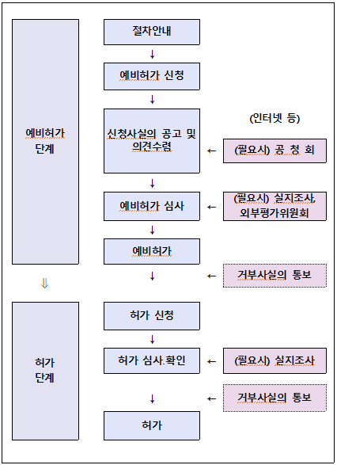

# 마이데이터 허가

  신용정보법상 본인신용정보관리업 영위 허가는 예비 허가와 본 허가로 구분된다.

## **본인신용정보관리업**(마이데이터산업)

: 개인인 신용정보주체의 신용관리를 지원하기 위하여 다음 사항의 전부 또는 일부의 신용정보를 대통령령으로 정하는 방식으로 통합하여 그 신용정보주체에게 제공하는 행위를 영업으로 하는 것

### **신용정보보호법 제 2조**

가. 신용정보 제공 · 이용자에게 신용위험이 따르는 거래로서 다음 각각의 거래의 종류, 기간, 금액, 금리, 한도 등에 관한 정보

나. 금융실명거래 및 비밀보장에 관한 법률 제2조 제3호에 따른 금융거래의 종류, 기간, 금액, 금리 등에 관한 정보

다. 보험업법 제 2조 제1호에 따른 보험상품의 종류, 기간, 보험료 등 보험계약에 관한 정보 및 보험금의 청구 및 지급에 관한 정보

라. 자본시장과 금융투자업에 관한 법률 제 3조에 따른 금융투자상품의 종류, 발행 · 매매 명세, 수수료 · 보수 등에 관한 정보

마. 상법 제 46조에 따른 상행위에 따른 상거래의 종류, 기간, 내용, 조건 등에 관한 정보

## 마이데이터산업 허가절차

### 신용정보보호법 제 4조

: 본인신용정보관리업을 하기 위해서는 금융위원회의 허가를 받아야 한다.

#### 허가절차 흐름도

 

 #### 예비허가

  본인신용정보관리업 예비허가의 심사기간은 2개월이며, 아래의 절차에 따라 진행된다.

1. 예비허가의 신청
   - 예비허가를 신청하고자 하는 자는 예비허가 신청서를 금융위에 접수

2. 신청사실의 공고 및 의견 수렴
   - 금융위는 예비허가의 신청이 있는 경우 이해관계인의 의견 수렴을 위하여 신청일자, 신청인, 신청취지 및 내용, 의견 제시방법 및 기간 등을 인터넷 홈페이지 등을 통하여 공고
     - 금융위는 필요하다고 판단되는 경우 신청사실의 공고와는 별도로 신청에 대한 이해관계인 의견을 요청할 수 있음
   - 금융위는 위 내용에 의하여 접수된 의견 중 신청인에게 불리하다고 판단되는 의견에 대하여는 신청인에게 이를 통보하고 기한을 정하여 소명토록 할 수 있음
   - 금융위는 금융시장에 중대한 영향을 미칠 우려가 있는 등 필요하다고 판단되는 경우 공청회를 개최할 수 있음
3. 예비허가 신청내용의 심사
   - 금융감독원장은 신청내용의 진위여부를 확인하고 이해관계인, 일반인 및 관계기관 등으로부터 제시된 의견을 감안하여 신청내용이 허가 심사기준에 부합하는지를 심사
   - 금융감독원장은 사업계획의 타당성 등에 대한 심사를 위해 외부 전문가로 구성된 평가위원회의 의견을 청취할 수 있음
   - 금융감독원장은 신청내용의 확인을 위해 이해관계인, 발기인 및 경영진과의 면담 및 실지조사 등을 실시할 수 있음
4. 예비허가 결정 및 통지
   - 금융위는 신청인의 예비허가 신청에 대하여 심사기준에 따라 예비허가 여부를 결정
   - 예비허가에는 조건을 붙일 수 있으며 예비허가를 거부하는 경우에는 서면으로 통보함
   - 예비허가는 허가 사항에 대한 사전심사 및 확실한 실행을 위하여 허가 이전에 예비적으로 행하여지는 허가권자의 의사표시이며 허가의 효력을 가지지 아니함

#### 본 허가

  신용정보업 본 허가의 심사기간은 3개월(예비허가를 거친 경우 1개월)이며 아래의 절차에 따라 진행된다.

1. 허가 신청서의 접수

   - 신청인은 예비허가의 내용 및 조건을 이행한 이후 허가신청서를 금융위에 접수

2. 허가

   - 금융위는 신청인의 허가 신청에 대하여 관련법규 등에서 정하는 심사기준에 따라 허가 여부를 결정, 통지하며 허가를 거부하기로 결정한 때에는 그 사실 및 거부사유를 신청인에게 서면으로 통보한다.
   - 금융감독원장은 허가 요건 충족여부를 심사하며, 예비허가의 내용 및 조건의 이행여부를 확인하기 위한 실지조사를 실시할 수 있다.
   - 금융위는 예비허가 또는 허가 심사시 필요한 보완서류 또는 추가자료의 제출을 기한을 정하여 신청인에게 요청할 수 있다.
   - 금융위는 예비허가 또는 허가시 부과한 조건이 있는 경우 그 이행사항을 확인한다.
   - 허가를 받은자가 정당한 사유 없이 1년 이상 계속하여 허가 받은 영업을 하지 아니한 경우 허가가 취소될 수 있다.

   

## 마이데이터 사업자의 업무 요건

### 신용정보보호법 제6조, 제20조, 제43조

1. 본인신용정보관리업을 하기에 충분한 전산설비 등 물적시설
2. 5억원 이상의 최소 자본금
3. 신용정보관리보호인 1명이상 지정
4. 배상책임 보험가입 의무

## 마이데이터 사업자의 업무사항

### 신용정보보호법 제11조, 제11조의 2

- 고유업무 : 본인 신용정보 통합조회
- 겸영업무(금융위원회에 미리 신고하고, 신용정보주체 보호 등에 저해할 우려가 없는 업무)
  - 투자자문업 또는 투자일임업
  - 금융상품자문업 등
- 부수업무(허가를 받은 영업에 부수하는 업무)
  - 해당 신용정보주체에게 제공된 본인의 개인신용정보를 기초로 그 본인에게 하는 데이터 분석 및 컨설팅 업무
  - 신용정보주체 본인에게 자신의 개인신용정보를 관리 · 사용할 수 있는 계좌를 제공하는 업무
  - 제 39조의 3 제1항(신용정보주체의 열람요구 등) 각 호의 권리를 대리 행사하는 업무

## 허가 신청시 제출 서류 목록

### 예비허가

- 본인신용정보관리업 예비허가신청서

- ­정관(안)

- 2년간의 사업계획서 및 예상수지계산서

- 발기인 총회의사록(이사회의사록) 사본

- 출자자(또는 주주) 구성 및 자금조달 계획

- 출자자의 인감증명서가 첨부된 출자확약서(출자비율 5%미만인 개인출자자는 제외)

- ­출자자의 출자자금 조달계획서

- ­출자자가 금융회사인 경우는 당해 금융회사 인허가권자의 인허가서 사본 또는 등록증 사본, 법인등기부등본, 사업자등록증 사본, 최근사업연도의 감사보고서 및 당해 금융회사의 일반현황

- 출자자가(당해 법인이 금융회사가 아닌 출자자 중 최다 출자자에 한함)가 일반법인인 경우 법인등기부등본, 사업자 등록증 사본, 최근 사업연도의 재무제표

   \* 신청인이 이미 설립된 법인인 경우에는 상기 첨부서류에 준하는 서류로 대체 가능

- 합작계약서(합작법인인 경우)
- 주요출자자가 주요출자자 요건을 충족함을 확인하는 서류
- 인력 및 물적시설(채용, 구매 등이 예정된 인력․물적시설 포함)의 현황을 확인할 수 있는 서류
- 허가 신청한 업무의 전문성을 갖출 수 있음을 확인할 수 있는 자료
- 임원(예정자 포함)이력서

### 본허가

- 본인신용정보관리업 허가신청서
- 정관 및 법인등기부 등본
- 재무제표
- ­2년간의 사업계획서 및 예상수지계산서
- 자본금 또는 기본재산의 지분을 기재한 서류
- 발기인 총회의사록(이사회의사록) 사본
- 출자자(또는 주주) 관계 확인서류 
- 자본금 납입증명 서류
- 외국인출자자인 경우 외국인의 출자가 ｢외국환거래법｣ 등에 저촉되지 않음을 확인하는 서류
- 합작계약서(합작법인인 경우)
- ­주요출자자가 주요출자자 요건을 충족함을 확인하는 서류
- ­물적시설을 갖추었음을 확인하는 서류
- ­허가 신청한 업무의 전문성을 갖추었음을 확인하는 자료
- 임직원에 관한 서류
- 임원의 이력서
- 직원의 상시고용을 확인하는 서류
- 법 제22조의8에 해당하지 않음을 확인하는 서류(필요시 이를 확인하는 각서 제출로 대체 가능)
- 제22조의9제2항에 따른 내부관리규정
- 회계처리․감사․조직관리 등 내부통제에 관한 규정
- 예비허가내용 및 조건의 이행을 증명하는 서류

출처.

1. 마이데이터 허가설명서FN.hwp