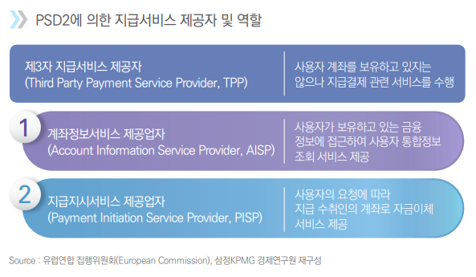
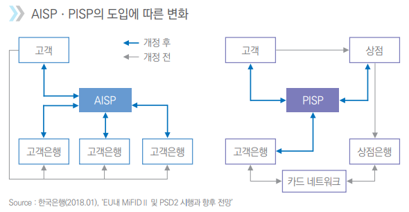
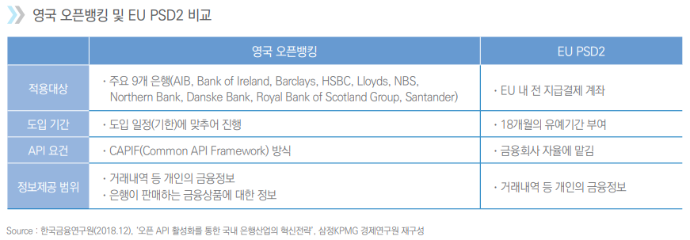
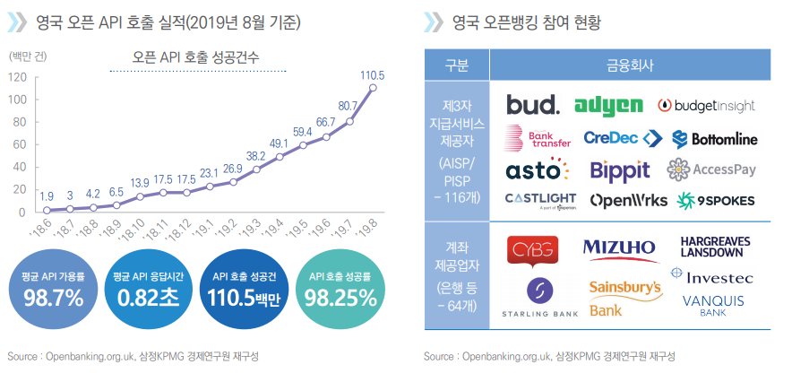
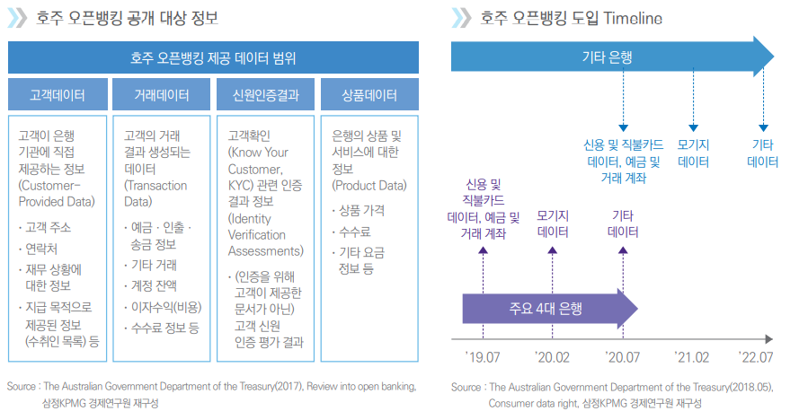
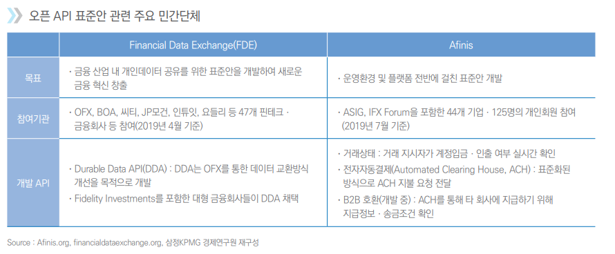

# 마이데이터와 금융

마이데이터는:

1. 개인정보 정보 이동권 행사: 개인이 기업에게 정보 제공 요구
2. 개인의 요청에 따라 기업은 마이데이터 사업자에게 데이터 개방: OpenAPI(Application Programming Interface) 방식
3. 개인정보 확인 및 활용: 해당 데이터를 기반으로 다양한 서비스 제공

## 국내

### ① 금융분야 마이데이터 사업의 법적 초석 마련

> 2018년 3월 금융위원회가 발표한 ‘금융분야 데이터 활용 및 정보보호 종합방안’에서는 ① 금융분야 빅데이터 활성화, ② 금융 분야 데이터 산업 경쟁력 강화, ③ 정보보호 내실화라는 3대 추진전략하에 10개의 세부 추진 전략을 설정

### ② 마이데이터 사업자에 대한 정책 마련

 금융 산업의 마이데이터 사업은:

 ① 신용정보주체의 신용관리를 지원하기 위해 개인신용정보를 일정한 방식으로 통합하여 개인에게 제공하는 행위를 업으로 한다고 정의

② 금융위원회의 허가를 받도록 함 

③ 이러한 개인신용정보는 안전성과 신뢰성이 보장될 수 있는 방식으로 전송 받을 수 있도록 하는 등 정보보호ㆍ보안은 강화

④ 데이터 분석 및 컨설팅, 신용정보 주체의 개인정보 자기결정권 대리행사 및 투자일임업ㆍ투자자문업 등을 부수ㆍ겸영 업무로 허용하며 업무범위를 정의 

## 해외

- 마이데이터에 대한 보안 개인정보 보호 문제 우려: 영국은 2018년도 오픈뱅킹에 대한 설문조사 실시, 그 결과 응답자들은 대부분 오픈뱅킹에 대해 **부정적으로 인식**하고 있고 개인정보와 관련된 사고 위험이나 보안에 대한 불신이 그에 대한 원인

 ### EU 금융분야: 금융회사에 오픈 API 구축을 통한 정보제공 의무화

> GDPR: 유럽 연합 일반 데이터 보호 규칙은 유럽연합의 법으로써 유럽연합에 속해 있거나 유럽경제지역에 속해 있는 모든 인구들의 사생활 보호와 개인정보들을 보호해주는 규제

- **PSD2(Payment Service Directive 2)**는 지급결제 시장의 활정화 및 통합이라는 목표를 가짐
  - 핵심: 정부 주체인 개인이 동의할 경우, 은행과 같은 **계좌기반 지급서비스 사업자(Serving Payment Service Provider)**가 보유하고 있는 고객 계좌정보 및 금융정보에 대해 **제3자 지급서비스 제공자(Third Party Payment Service Provider, TPP)**의 계좌접근을 허용하였다는 점
  -  이를 위해 EU 내 모든 대형 금융사에게 *오픈 API* 형태로 고객 금융정보를 제공할 것을 의무화
  - PSD2는 계좌정보 서비스(Account Information Services)와 지급지시대행 서비스(Payment Initiation Services)를 지급서비스 범위에 추가
  -  제3자 지급서비스 제공자를 크게 계좌정보서비스 사업자(Account Information Service Provider, AISP)와 지급지시대행 서비스 사업자(Payment Initiation Service Provider, PISP)로 정의

- PSD2가 제정됨에 따라, 제3자 지급서비스 제공자는 금융회사가 독점해오던 고객 금융정보를 활용하여 통합조회ㆍ분석 서비스나 직접 자금을 이체하여 결제 업무를 **대행해주는 서비스를 제공 가능**

### 영국 금융분야: 9개 주요 은행에 오픈API 개방 의무화

- EU의 PSD2 시행에 대한 대응으로 자체 오픈뱅킹(마이데이터 금융 영역) 정책을 의무화
  - 'Open Banking Standard 3.0'을 발표, 오픈API 표준안을 마련
  - 18년 1월부터 오픈뱅킹 정책 시행, 9개 주요 은행 대상 고객 및 금융상품 정보 개방 의무화

- 2018년 1월 13일 시행 이후 참여 기관 확대 등으로 이용 실적이 증가세

### 호주 금융분야 : 조회형 API 4대 은행 선도입 후 점증적 확대

> 2017년 12월 발간된 오픈뱅킹 리뷰 보고서는 호주정부에 오픈뱅킹 도입을 위한 가장 적절한 모델과 이를 구현하기 위한 최적의 방안을 고안하여 이를 호주정부에 권고

- 2017년 7월에 재무성을 중심으로 호주에 가장 적합한 오픈 뱅킹(Open Banking) 모델을 논의한 끝에 11월26일 데이터에 대한 소비자권리를 보장하는 **‘소비자데 이터권리(Consumer Data Right, 이하 ‘CDR’이라함)’정책** 도입 발표
  - CDR 목적: 소비자가 정보 사업자(data holders)가 보유 중인 소비자 본인의 정보를 효과적이고 편리하게 접근하며, 본인이나 본인이 지정한 제3자에게 안전하게 정보를 제공하도록 하는 등, 데이터에 대한 소비자 통제권을 강화하는 것
  - CDR 은: 소비자를 위한(for the Consumer), 소비자에 관한(about the Consumer), 소비자 관점으로의 조망(Consumer's  perspective) 이 기본
  - 소비자가 시장의 경쟁을 통해 선택권 등의 편익이 향상되도록 관련 재화와 서비스 시장의 경쟁을 제고하는 방향으로 진행
  - 정보를 활용한 개인화된 서비스와 같이 새로운 아이디어와 사업들을 출현하고 성장하는 기회 창출에 기여
  - 효율성과 공정성을 동시에 추구, 곧 지속하능한 공정성을 위해 정보 보안과 프라이버시 확보를 기반으로 하되 필요 이상으로 복잡하거나 많은 비용 소모 X

- 호주는 정해진 타임라인에 의해 오픈뱅킹의 적용 대상과 범위를 점진적으로 확대해 나간다는 방향성을 가지고 오픈뱅킹을 추진
- 호주는 4대 은행 (Commonwealth, Westpac, ANZ, NAB)에 먼저 오픈뱅킹을 적용하고, 신용ㆍ직불카드, 에금 및 거래계좌 데이터를 시작으로  2020년 2월까지 주택담보대출 관련 데이터로 공개 범위를 확대할 예정
  - 정보 공개 범위도 계좌 및 거래정보, 은행 상품 정보뿐만 아니라 나아가 고객이 제공한 데이터도 포함될 예정
  - 특징:  
    - 호주의 오픈뱅킹은 전 세계 모든 나라들 중 은행정보 개방의 범위가 가장 넓다는 점,
    - 개방 의무화 대상에 지급결제ㆍ송금 서비스를 위한 실행형 API는 제외하고 데이터 조회ㆍ전송을 위한 조회형 API만으로 한정 하였다는 점

- 호주의 오픈뱅킹은 2020년 7월부터 금융권의 모든 상품 및 거래데이터, 고객데이터 등에 대한 활용을 목표

### 미국 금융분야 : 민간 차원의 자율적 데이터 공유 추진

> 미국에는 개인의 금융 데이터를 제3자와 공유하도록 금융회사에 의무화하는 법적 요건은 현재 부재, 오픈뱅킹에 대한 규정을 도입하고 있지 않음

- 미국 내 금융 데이터 공유 움직임은 민간을 중심으로 자발적으로 추진
- 개인 금융 데이터를 안전하게 공유하는 방안을 마련하기 위해 다수의 대형 은행들과 핀테크 기업 등이 제휴하여 2018년 Financial Data Exchange(FDE)를 설립

