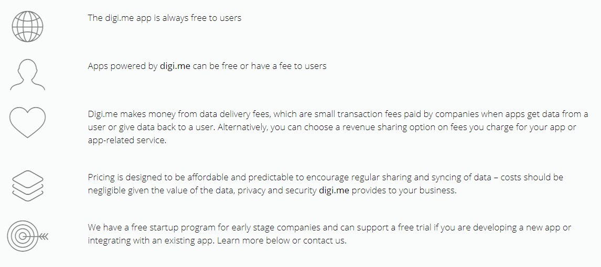

# digi.me 수익모델

- 디지미를 사용하는 모든 사용자들은 항상 무료
- digi.me에서 제공하는 앱은 무료이거나 유료일 수 있음
- digi.me은 데이터 전송 수수료로 돈을 벌고 있는데, 이는 앱이 사용자로부터 데이터를 얻거나 사용자에게 데이터를 반환할 때 회사에서 지불하는 소액 거래 수수료. 
- 앱 또는 앱 관련 서비스에 대해 청구하는 요금에 대한 수익 공유 옵션을 선택할 수 있음.
- 가격은 저렴하고 예측 가능한 데이터 공유 및 동기화를 장려하도록 설계
- digime는 기업에 데이터와 개인 정보 보호 및 보안 제공 ->이 가격은 매우 미미하다고 함
- 스타트업 기업을 위한 무료 시작 프로그램이 있으며, 새로운 앱을 개발 중이거나 기존 앱과 통합할 경우 무료 평가판을 지원

출처: digi.me

# 데이터 거래소 수익구조

> 데이터 수요자와 공급자가 데이터를 사고파는 데이터거래소

- 은행, 증권, 카드사가 자신들이 보유하고 있는 데이터의 내용과 포맷, 샘플을 거래소에 올리면 다른 금융회사나 핀테크 기업 또는 일반 회사가 비용을 지불하고 데이터를 사들여 이를 영업에 활용하는 형태

> 예를 들어, 은행이 입출금 거래 패턴과 대출 연체의 상관관계를 모형화할 수 있는 익명의 데이터를 거래소에 올리면, 신용평가 모형을 개발하려는 핀테크 회사가 이를 사들여 신용평가 모형을 업그레이드하는 식

- 반대로 데이터를 구매하고자 하는 수요자가 원하는 데이터나 제공 형태를 특정해 요청하면 공급자가 이 요청을 받아 데이터를 제공하는 경우도 발생
- 데이터 유통에 식별 가능한 개인정보만 없으면 금융 데이터 외에도 통신·유통·보건의료·교통·제조 등 다양한 데이터가 거래될 수 있음

출처: [데이터 비즈니스, 나의 모든 데이터가 돈이다 | 1boon (kakao.com)](https://1boon.kakao.com/kcie/5f60683da6e3606d4827c13d)

# 개인정보를 이용한 수익구조

> 소비자 데이터의 규모와 다양성이 커지는 가운데, 비즈니스 영역에서 개인정보보호의 가치를 강조하는 새로운 데이터 이용 모델들이 등장

두가지 유형 존재: 

1. **개인정보보호를 위한  지불(pay-for-privacy, PFP) 모델**: 개인정보보호 기능을 강화하기 위해 소비자가 추가 비용을 지불
2. **개인데이터경제(personal data economy, PDE) 모델**: 개인으로부터 직접 데이터를 구매하는 등 정보주체 개인의 통제권을 강화

### PFP 모델

>  배경: 많은 기업들이 개인정보보호에 대한 소비자 요구가 증대되고 있다는 점에 주목하고 있으며, 소비자가 개인정보보호를 위해 추가 비용을 지불하도록 하는 비즈니스 모델을 도입
>
> 정의: 정보주체의 통제력을 강화하거나 데이터 보호 기능을 제공하는 제품과 서비스에 대해 더 높은 가격을 책정

- 대표적 사례: 미국의 인터넷서비스제공업체(ISP)들이 2016년 개인정보 추적을 거부하고 광고 목적으로 데이터를 사용하는 것에 동의하지 않는 소비자에게는 더 높은 가격을 부과하도록 허용해야한다는 주장을 제기한 것
- 개인정보 수집에 동의하는 사용자에게는 더 저렴한 요금이나 특정한 할인 혜택을 제공함으로써 정보주체 개인들의 거부감을 상쇄하는 방식으로 개인정보를 확보
  - 개인정보의 유통과 활용에 따른 혜택과 수익은 주로 기업들이 확보하고, 정보주체인 개인은 오히려 개인정보보호를 위한 추가 비용을 부담해야 하는 상황이 발생
- PFP 모델에서는 개인정보보호를 판매하거나 구매할 수 있는 *‘대상’*으로 변환

주요 유형: 

1. **개인정보보호의 고급 상품화(Privacy-as-a-Luxury) 유형** : 개인정보보호 및 데이터 보안 옵션이 있는 제품이나 서비스를 다른 경쟁 제품보다 더 높은 가격에 제공
   1. 사생활 보호를 위해 더 많은 비용을 지불할 의향과 능력이 있는 소비자를 겨냥하여, 개인정보에 대한 정보주체의 통제권을 제품 차별화 속성으로 활용
   2. 사례1: FastMail의 경우 - 개인정보보호기능이 강화된 이메일 서비스를 유로로 제공
   3. 사례2: 사용자의 웹 브라우징 이력이 추적되지 않는 가상사설망(VPN) 이용료를 부과하는 등 구독(subscription)기반 서비스를 제공
   4. 이러한 비즈니스 모델을 채택한 기업은 제3자가 소비자 데이터에 **무제한으로 접근하지 못하도록** 할 것이며, 결과적으로 데이터 브로커(data broker)의 소비자 데이터 확보를 어렵게 만들 수 있음
   5. 개인정보보호 강화를 위해 더 높은 가격을 지불할 의사가 있는 소비자의 수가 증가함에 따라 기업들은 제품 및 서비스 제공 방식을:
      1. 무료
      2. 무료와 유료가 혼합된 프리미엄(Freemium)
      3. 개인정보보호 및 데이터 통제 기능이 강화된 고급으로 분류 가능
2. **개인정보보호 제공을 통한 할인(Privacy-Discount) 유형**: 개인정보보호 기능을 상품화한 유형과는 반대로 개인정보보호를 포기하는 소비자에게 할인 혜택을 제공
   1. 데이터를 통한 비용 지불(Data-as-Payment) 유형에서 소비자가 무의식적으로 자신의 개인정보와 데이터를 서비스 이용 대가로 교환하는 것과 달리, 개인정보보호 제공을 통한 할인(Privacy-Discount) 유형은 **소비자가 할인 혜택을 위해 의식적으로 개인정보를 제공**
   2. 기업은 소비자가 제공한 개인정보를 분석 및 활용하여 광고를 비롯한 다양한 수익을 확보함으로써 할인 혜택에 따른 비용 손실을 보전

### PDE 모델

>  정보 주체의 권리를 강화하는 개인정보 활용 모델로서, 개인정보를 보호하는 동시에 정보주체가 자신의 데이터를 통해 수익을 창출할 수 있는 혁신적인 비즈니스 모델을 장려

- *"개인이 자신의 정보에 대한 소유권을 가지고 비즈니스와 정보를 공유 할 수 있도록 허용하는"* 사용자 중심의 데이터 거래를 추진
- 정보주체는 개인정보의 내재 가치에 대한 이해를 높일 수 있고, 기존의 소비자 데이터 활용 모델과 달리 개인정보 수집과 이용의 투명성을 확보할 수 있음 

주요 유형:

1. **데이터 통찰력(Data-Insights) 유형**: 기업이 개인정보 이용에 대한 정당한 비용을 지불하고 개인정보 활용시 안전한 보호 조치를 하도록 보장
   1. 정보 주체 개인이 자신의 데이터를 공유할 대상과 범위를 직접 통제하고 정당한 대가를 확보하도록 지원
   2. Cosy, Digi.me, Meeco 등 다양한 업체들이 이러한 서비스를 제시하고 있으며, 서비스를 뒷받침하기 위한 기술적 솔루션을 제공 
      1. Cosy: 개인용 서버에서 다양한 데이터를 호스팅할 수 있는 "개인용 클라우드 솔루션"을 제공
      2.  Digi.me: 자사 플랫폼을 개인 데이터 관리 허브로 활용할 수 있도록 소비자가 여러 출처에서 수집한 자신의 개인 데이터를 통합할 수 있는 애플리케이션을 제공
      3. Meeco: 소비자가 기본 프로필 정보, 연락처, 브라우징 습관, 좋아하는 브랜드 등 자신에 관한 방대한 양의 데이터를 관리할 수 있는 무료 플랫폼을 제공
   3. 이를 통해 소비자는 데이터 경제에서 수동적인 태도에서 벗어나 개인정보의 수익화에 동참하는 적극적인 역할을 담당할 수 있음 
2. **데이터 전송(Data-Transfer) 유형**:  소비자가 자신의 개인정보 및 각종 데이터를 매매하고 이를 통해 수익을 창출할 수 있는 마켓 플레이스를 제공
   1.  Datacoup: 개인의 금융데이터와 소셜 미디어 데이터 등을 수집하여 개인이 원하는 조건으로 제3자에게 판매할 수 있도록 지원하는 중개 서비스를 제공
      1. 정보주체 개인이 자신의 SNS 계정이나 신용카드 및 체크카드 정보를 DataCoup 사이트에 입력하고, 해당 데이터 중 원하는 부분을 선택하여 판매 리스트에 추가할 수 있으며, 개인은 자신의 계정을 통해 판매 대상 데이터의 종류와 판매 현황 등을 파악 
      2.  데이터의 판매 단가는 Datacoup에서 자체 가격 모델을 기준으로 결정하며, Datacoup이 직접 개인들의 데이터를 구매 후 이를 비식별화된 데이터 풀로 가공한 후 제3자에게 판매하는 수익 모델도 적용 
   2. 정보주체 개인이 스스로 자신의 정보를 입력하고 거래조건을 설정할 수 있도록 통제권을 보장
   3. 데이터 브로커가 실질적으로 독점하고 있는 기존의 소비자 데이터 거래 시장에서 정보주체들을 대부분 자신의 데이터가 수집되고 판매되고 있다는 것을 인식하지 못하는 반면, 이러한 유형에서는 **누가 어떤 데이터를 구매하는지 더 쉽고 투명하게 확인이 가능**
   4. 데이터 브로커 대신 정보주체 개인들로부터 직접 개인정보 및 데이처를 구매함으로써 기존의 데이터 거래 관행을 변경할 수 있음

출처: 한국인터넷진흥원(KISA)

