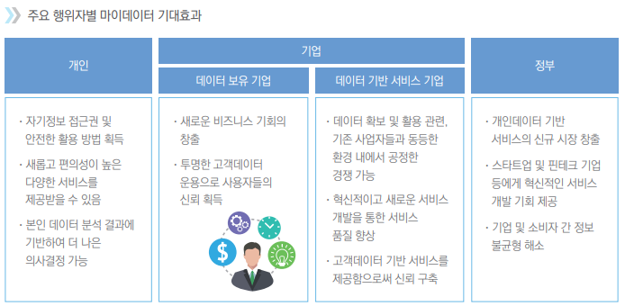
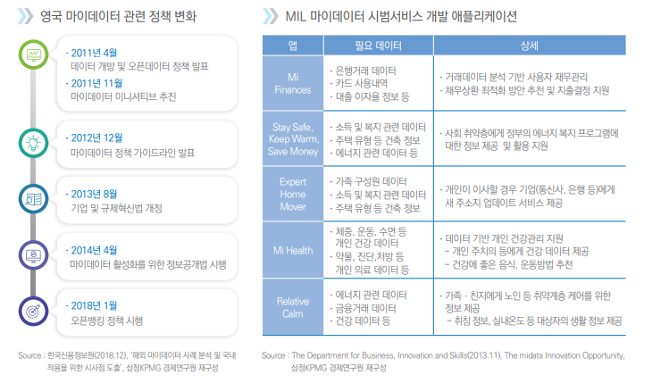
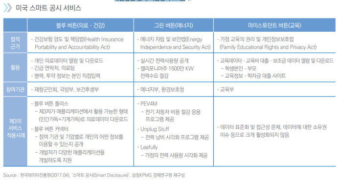
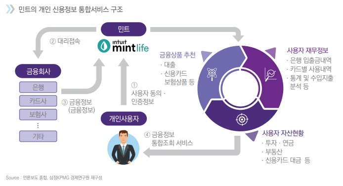
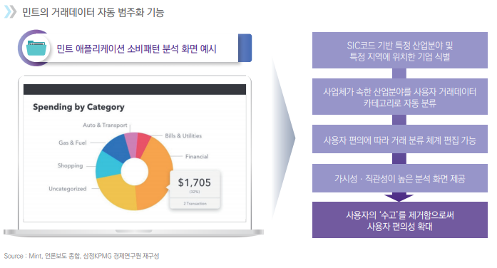
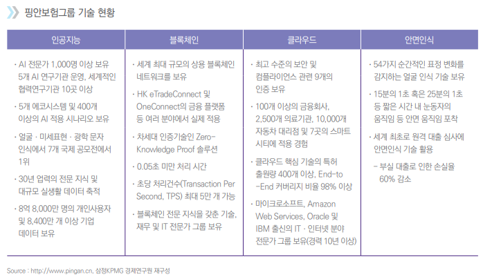

# 마이데이터 정리

> 배경: 디지털 기술혁신으로 촉발된 디지털 전환이 금융 산업뿐만 아니라 전 산업부문으로 확산되면서 데이터를 활용한 비즈니스는 폭발적으로 증가하고 있으며, 개인데이터의 경제적ㆍ사회적 가치 또한 점점 더 중요
>
> 이렇게 데이터 활용에 대한 중요성이 점증하는 디지털 사회로 전환하는 가운데, 생성되고 축적되는 데이터 양이 방대해지고 그 종류도 다양해짐에 따라 ‘내’가 생성하는 ‘나의’ 데이터에 대한 통제권과 개인정보 보호가 중요한 문제로 부각

--->이에 따른 해결책으로 등장한 개념이 **마이데이터**

## 마이데이터?

정보 주체인 개인이 ‘정보 이동권(Right to Data Portability)’에 근거하여 본인 데이터에 대한 개방을 요청하면, 기업이 보유한 데이터를 개인(요청자) 또는 개인이 지정한 제3자에게 개방하도록 하는 것

- 본인 데이터에 대한 개인의 통제력 및 권한을 강화함으로써 정보 주체자의 의지에 따라 데이터에 대한 개방 및 활용을 용이하게 하는것을 의미
- 이전: 개인데이터는 해당 금융회사의 전유물인 것처럼 폐쇄적으로 운영ㆍ관리되어 개인이 권리를 주장하기 어려웠음
- 마이데이터를 도입하게 되면 금융분야에서는 개방된 데이터를 활용하여 개인에게 다양한 데이터 기반 금융서비스가 활성화될 수 있음
  - 여러 금융회사에 분산되어 있는 본인의 데이터를 한번에 확인/관리할 수 있게 되고 데이터 기반의 맞춤형 재무서비스나 금융상품 비교/추천 등의 개인의 편의성을 향상시킬 수 있는 **새롭고 다양한 금융 서비스가 가능**해짐




### 정보주체의 권리보장 및 데이터 제공에 대한 기업 의무화

마이데이터 활성화를 위해서는:

1. 기업이 보유한 본인 데이터에 대해 제3자로 전송 (개방)을 요구할 수 있는 개인의 정보 이동권에 대한 법적 근거가 마련되어야 한다. 
2. 개인의 요청에 따른 기업의 데이터 개방이 의무화되어야 하며 셋째, 신뢰할 수 있는 제3자로 데이터가 원활히 그리고 안전하게 전송되어야 한다

데이터 제공의 기술적 방식이 상호운용성이 높을 경우, 데이터의 개방성을 확보할 수 있으며, 개방된 데이터는 상호 운용이 가능하도록 기계가 안전하게 판독할 수 있는 형태(Machine Readable Format)로 온라인(Online)상 접근할 수 있는 것이 가장 이상적이다.


### 마이데이터 선결요소, 개인정보 보호 및 보안문제

개인의 데이터를 보유하고 있는 기업 및 기관(데이터 제공자)은 데이터가 적절한 수신자(데이터 활용자)에게 안전하게 전달될 수 있도록 데이터를 요청하는 개인(요청자)의 신원을 정확하게 확인ㆍ인증해야 함.


### 영국 마이데이터

- 영국은 금융ㆍ통신ㆍ 에너지 부문에서 **Midata 프로그램**  시범사업 운영

> Midata: 2011년 영국 정부가 기업들이 보유하고 있는 소비자 정보를 디지털화하여 소비자에게 제공 하는 정책
>
> 이 법을 근거로 Midata의 중점 추진 분야에서 기업의 정보 공유를 의무화함으로써 데이터 공유에 대한 기반을 마련함

-  Midata 이니셔티브에 동참한 26개 조직이 참여하여 **마이데이터 혁신연구소(Midata Innovation Lab, MIL)**라는 기구를 창립
-  MIL은 혁신연구소를 표방하며, 금융, 통신, 에너지 등의 실시간 데이터를 수집ㆍ활용하여 서비스 개발을 위한 시범 사업을 운영
  - MIL이 실증 실험에서 개발한 애플리케이션으로는 Mi Finance(개인금융), Stay Safe, Keep Warm, Save Money(에너지ㆍ복지), Expert Home Mover(개인정보 업데이트), Mi Health(개인 헬스케어), Relative Calm(노인 및 취약계층 모니터링 서비스) 등이 있음
  - MIL은 개인데이터를 소비자에게 개방함으로써 창출되는 경제적ㆍ사회적 가치를 확인하고 Midata 프로그램의 확산 기회를 모색했다는 점에서 의미가 있음




### 호주 마이데이터

- 호주는 ’19년 7월부터 주요 4대 은행에 오픈뱅킹 의무화··· 적용 대상 및 제공 데이터 범위 확대 추진

> 2017년 11월 26일 호주 정부는 데이터에 대한 개인의 권리를 보장하는 **소비자 데이터 권리 (Consumer Data Right, CDR) 정책 도입**을 발표.  이후 2017년 12월 오픈뱅킹으로의 전환을 위해 관련 규제와 운영 방안을 담고 있는 권고안인 **‘오픈뱅킹 리뷰(Review into Open Banking in Australia)’**를 발간

금융 부문은 CDR이 시행될 첫 번째 분야로, 이후 에너지업, 통신업 부문으로 적용 분야를 확대하는 등 CDR은 점진적으로 경제 전반에 걸쳐 도입될 예정

- p12 호주 오픈뱅킹 


### 미국 정책분야: 연방정부 관리대상 개인정보에 대한 데이터 개방

> 미국은 유럽의 GDPR과 같은 공공과 민간을 아우르는 종합적이고 포괄적인 연방정부 차원의 개인정보 일반법이 부재하기 때문에, 주정부별로 관리 권한이 있는 개인정보는 마이데이터를 추진하기가 쉽지 않음 ----> 미국은 **연방정부 차원에서 관리하는 개인정보**에 대해 우선적으로 마이데이터를 추진

- 미 행정부는 중요한 개인데이터에 대한 접근을 확대하기 위해 보건, 에너지, 교육과 관련하여 개인데이터를 다운로드 할 수 있는 서비스를 제공. 
  - 개인 건강 데이터의 경우 퇴역군인, 의료보험대상자 등 개인은 의료기관 웹사이트에서 **‘블루 버튼’**을 클릭함으로써 의료기록에 접속하고 이를 전자파일 형식으로 다운로드 받아 활용할 수 있음
  - 메디케어 및 메디케이드 서비스센터(Centers for Medicare and Medicaid Services, CMS)는 현재 블루버튼의 상호 운용성과 사용자 인증을 개선하기 위해 API 방식의 블루버튼 2.0 이니셔티브(Blue Button 2.0 Initiative)를 추진
  - 개인 에너지 데이터는 소비자가  **‘그린 버튼’** 을 클릭함 으로써 자신의 에너지 사용량 및 요금 관련 데이터를 확인할 수 있도록 해
  - 개인 교육 데이터의 경우, 사용자는 **‘마이스튜던트 버튼’**을 클릭함으로써 데이터를 활용하여 학습 양식을 만들거나 또는 본인의 연방정부 학자금 지원(Federal Financial Aid) 데이터를 활용하여 장학금 찾기 또는 대출상환 등에 사용할 수도 있음



#### 민트(Money Intelligence): 편의성이 최적화된 재무관리서비스

>  개인의 금융정보를 손쉽고 간편하게 관리할 수 있도록 신용정보 통합서비스를 제공하는 미국의 금융 서비스 회사

- 민트는 은행 계좌 입출금내역, 신용카드 사용내역, 투자내역 등 개인사용자의 다양한 금융 정보 및 데이터를 자동으로 집계하여 재무상태를 종합적으로 관리할 수 있도록 해줌
- 사용자가 은행계정을 민트와 연동하면 계좌 입출금 거래가 발생함에 따라 민트는 거래데이터를 자동 으로 수신
- 신용카드 사용내역, 개인의 투자내역, 기타 금융계좌 또한 은행과 마찬 가지로 사용자가 연동만 완료하면 동일하게 사용 가능
- 사용자 입장에서는 개인 금융데이터 활용을 동의하면, 하나의 플랫폼에서 자신의 모든 금융정보 및 재무 상황을 편의성 및 가시성이 최적화된 형태로 파악할 수 있음
- 집계되는 데이터를 깔끔하고 직관적인 통계나 그래프를 통해 사용자의 소비패턴을 보여줌






## 중국의 '핑안보험그룹'

>  세계 최고 수준의 기술 주도 금융서비스 회사

- 핑안은 디지털 전환(Digital Transformation)의 일환으로 디지털 플랫폼을 채택

- 이미 보험 사업을 넘어 최첨단 기술 회사로 성장하였으며, 인공지능(AI), 블록체인(Blockchain), 클라우드(Cloud) 등의 분야에서 높은 수준의 기술을 보유
- 발전된 기술을 금융서비스, 의료, 자동차, 부동산, 스마트시티(Smart City) 등 핑안이 보유한 플랫폼 및 사업 생태계에 접목함으로써 디지털 혁신을 주도함과 동시에 중국인의 생활 방식도 변화시키고 있음
- 
- AI, 클라우드, 블록체인 등 핑안이 보유한 세계 최고의 핵심 기술력을 활용하여 금융뿐만 아니라 의료, 자동차, 부동산, 스마트시티 등 그룹의 5대 생태계 안에서 새로운 고객 경험을 제공하고, 리스크 관리를 강화함과 동시에 업무 효율성을 향상 --->기술의 이점을 극대화하여 상품 경쟁력을 강화함으로써 생태계를 활성화
- 핑안은 모든 상품을 고객에서 원스톱(One-Stop Service)으로 제공하는 통합 금융서비스 플랫폼을 지향하고 있으며, 이를 위해 핑안은 고객이 하나의 계정으로 금융 및 디지털 플랫폼의 모든 서비스를 사용할 수 있는 통합 단일 계정(Total One Account) 모델을 구축
- 파악된 고객의 니즈에 따라 고객에게 가장 적합한 금융 상품이나 서비스를 제안하고 추천함으로써 핑안의 금융 생태계에서 제공하는 상품과 서비스에 대한 수요로 이어짐


## Harvard University

### Data Sharing Research Project

```
“Digi.me really is an ideal platform for this kind of research, with the ability both to transfer large amounts of information, and do it in such a secure, private way.”
```

A **longstanding research project based at Harvard University in the United States has been exploring how it can partner effectively with digi.me.**

The project’s participants are drawn from the Nurses’ Health Study 2, which runs jointly across the Harvard T.H. Chan School of Public Health and Brigham and Women's Hospital, an affiliate of Harvard Medical School.

The health study has been going since 1989 and has over 100,000 nurses taking part from all over the US. They receive questionnaires every two years asking them about their behaviour, lifestyle and health, as part of the study’s overarching goal to further understand how to prevent chronic disease through lifestyle and behavioural changes.

Professors Laura Kubzansky, Lee Kum Kee Professor of Social and Behavioral Sciences at the Harvard T.H. Chan School of Public Health and Fran Grodstein, formerly of Harvard Medical School and now Adjunct Professor of Epidemiology at the Harvard T.H. Chan School of Public Health, are working with some of the study participants to understand what positive benefits certain attributes, such as having a positive outlook or being optimistic, can bring to health outcomes.

As part of this, they began wondering about the idea of using social media to assess some of the attributes they were interested in. For the cohort they had in mind, who are in their 50s and 60s, this meant getting their consent to study the language of their Facebook posts.

They obtained funding for the project, but then the Cambridge Analytica scandal broke, and access to Facebook data was shut down. At “a complete loss – how were we ever going to do this project?” they learned about digi.me through a personal contact of Professor Kubzansky’s with expertise in companies dealing with data privacy issues.

Digi.me, said Professor Grodstein, was “just ideal for us as we’re always concerned about participant privacy, security, and confidentiality. “Government has lots of rules for human research, our institutions have lots of rules, and we as researchers impose really high standards on ourselves to ensure privacy to as high a standard as possible for all the information the participants so generously share with us.”

Digi.me was a “beautiful solution” and she and Professor Kubzansky worked with the digi.me team on a customised version of the main app, so that participants could, completely securely, send their Facebook data directly to the researchers. Professor Grodstein said: “Digi.me really is an ideal platform for this kind of research, with the ability both to transfer large amounts of information, and do it in such a secure, private way. All the digi.me parts worked beautifully and were an ideal fit for our needs.”

Professor Kubzansky added: “We were also very impressed with everyone we worked with at digi.me who were highly responsive to our concerns and requirements and routinely made themselves available for troubleshooting and evaluating how processes were working. “We would absolutely work with them again if we had similar needs.”

An independent Institutional Review Board, which assesses how ethical research studies are, approved the use of digi.me for providing a secure and confidential way to transfer information and had no concerns about the platform.

The researchers are now exploring how they can work with other cohorts, and other social media platforms, to get more of the kind of data they are interested in, with full consent from those with whom they are working.


## 발전방향

- 디지털 경제 시대가 도래함에 따라 소비자의 전통적 구매 척도였던 시장 내 브랜드 파워, 자본 규모 등의 중요성은 희석되고 있음. 반면에 데이터 축적량, 데이터 분석력과 같이 데이터로 가치를 창출하여 고객 니즈에 부응하는 역량은 기업의 매우 핵심적인 경쟁요소가 됨
- 향후 개방되는 데이터가 금융ㆍ비금융을 망라하여 무궁무진해질 것으로 예상되는 만큼, 기업은 이전과는 질적으로 다른 정밀한 데이터 역량이 요구됨
-  민트를 비롯한 해외 마이데이터 사업자들은 개인신용통합 조회 등 단순히 단일 서비스를 제공하는 것을 넘어, 데이터 분석 및 이에 기반한 상품 추천 등 다양한 서비스를 추가하며 서비스 영역 확장을 꾀하고 있음
- 기업도 이와 같이 기존의 서비스 모델을 중심으로 보다 다양한 부가서비스를 시도하거나 타 사업자와 제휴하여 새로운 서비스 영역을 추가하는 등 고객 편의성을 지속적으로 개선하는 데 노력해야 할 것임
- 히 본인 인증, 데이터 암호화, 백업, 데이터 유통플랫폼 간 연계 방안, 데이터 검색을 위한 데이터 카탈로그, 정보의 교환ㆍ검색에 필요한 API 구축방안 등 관련 기술의 최신 트렌드에 대한 검토 및 도입은 장기적으로 사업의 안전성을 확보하기 위해 필수적
-  보안사고 발생을 대비하여 실제 사고사례 분석에 근거한 영향도 조사, 추적 조사 등 실용적인 대응방안을 수립하고, 피해에 대한 명확한 보상방안을 수립함으로써 소비자의 신뢰를 높이는 데도 힘써야 할 것


# 디지미 : 정보 보호에 기반한 개인데이터 공유 플랫폼

  영국에서 설립된 **개인 데이터 저장소(Personal Data Store, PDS)** 사업자다. 개인의 정보를 단일 플랫폼에서 수집, 관리, 활용할 수 있는 통합 플랫폼을 표방하고 있다. 디지미와 같은 **PDS**는 개인정보를 수집하고 유통회사나 금융회사 등 다른 기업에 해당 데이터를 제공하여 수익을 창출한다는 점에서 데이터 브로커와 비슷하다. 개인의 의지와 상관없이 온라인상 개인정보를 무작위로 방대하게 수집하는 데이터 브로커와 달리, **PDS**는 제 3자에 대한 개인정보 제공 여부를 정보주체인 **개인 스스로**가 결정한다는 점에서 차이가 있다.


## 1. 사용자 중심으로 광범위한 데이터를 한 곳에서 통합 관리

  디지미가 수집하는 개인정보는 크게 금융, 소셜, 의료, 헬스케어, 엔터테인먼트 정보로 구분된다. 금융정보의 경우, 디지미는 금융회사의 계좌 정보를 제공하는 미국 핀테크 기술 기업인 플레이드와 제휴하여 거래내역을 취합할 수 있다. 비금융정보의 경우 소셜정보는 페이스북, 트위터, 인스타그램 등을 통해 소셜 네트워크 활동 내역을 취합할 수 있다. 건강 정보의 경우, 건강 웨어러블 장치 기업인 핏빗 등을 통해 사용자의 활동 내역, 수면 기록 등을 입수한다.


  사용자의 편의를 극대화하기 위해 디지미 사용방법은 **아주 간단하고 직관적이며**, **사용자 친화적**이다. 디지미를 통해 수집되는 개인데이터에 대한 저장 위치를 선정할 수 있으며 자신의 클라우드 계정에 저장하도록 선택할 수 있다. 사용자가 관리하고자 하는 정보를 디지미를 통해 연계, 취합하고 다양한 앱을 선택하여 자신이 공유한 데이터에 기반하여 서비스를 이용할 수 있다. 사용자는 원하는 서비스를 선택하여 누구에게 어떤 데이터를 제공할지 여부를 모두 스스로 결정할 수 있다.  디지미는 사용자의 권한, 프라이버시를 강화하기 위해 원천적으로 플랫폼 내 모든 개인데이터에 대한 권리를 소비자에게 부여하는 한편, 개인의 데이터를 디지미 플랫폼 내 스토리지 공간이 아닌 사용자 자신의 **개인 클라우드 스토리지에 저장**할 수 있도록 지원함으로써 **사용자 중심의 정보관리 체계**를 구축하였다.


## 2. 데이터와 관련된 플랫폼 비즈니스 모델 시도

  디지미는 데이터 생산자(사용자)와 이를 활용하는 기업 간 데이터 중개자로서 플랫폼 비즈니스를 지향하고 있다. 개인의 입장에서는 디지미는 데이터의 수집부터 저장 및 공유에 이르기까지 개인정보 관리 전 과정을 지원하는 PDS 서비스를 무상으로 제공한다. 

### 디지미 사용방식


  디지미의 데이터는 사용자 동의에 근거하여 데이터를 제공받기 때문에 데이터 브로커들의 데이터보다 품질 및 신뢰성이 우수하다.  또한 사용자에 의해 지속적으로 업데이트 되는 최신 데이터를 안정적으로 확보할 수 있다는 점에서 경쟁력이 높다. 제공받은 데이터를 활용하여 앱을 개발하고 디지미와의 제휴를 통해 디지미 플랫폼 내에서 앱을 상용화할 수 있다.

  디지미는 기업에 제공하는 데이터 트랜젝션 또는 디지미와 연계하여 창출되는 앱 수익의 일정 부분을 수수료로 부과함으로써 수익을 올린다. 디지미는 데이터 생산자와 사용자가 만나 교차 네트워크 효과가 발생할 수 있는 플랫폼이다. 많은 소비자가 유입될수록 이를 활용하고자 하는 기업이 많아진다. 이에 따라 소비자 친화적이며 혁신적인 앱이 개발되고 출시되면 더 많은 수비자가 유입되는 선순환적인 구조를 가지고 있다.


## 3. 데이터 권한 강화에 대응한 새로운 비즈니스 모델

  데이터 사업 모델은 데이터 브로커를 넘어서서 데이터 마켓플레이스, PDS, 정보은행으로 진화중이다. 정보은행은 PDS기능과 더불어 데이터 판매에 대한 보상과 개인데이터의 관리 대행이라는 데이터 신탁 개념까지 포괄한다. 정보은행은 데이터 관리, 활용, 판매 등 개인의 데이터 관리를 대리해준다는 측면에서 해당 기관에 대한 높은 신뢰가 필요하며 개인이 제공한 데이터에 대한 대가로 금전이나 유,무형의 편익 등 경제적 이익을 제공하는 실험적 모델이다.


  디지미는 데이터에 대한 개인의 권한 강화 기조를 반영하여 디지미가 개인 데이터를 열람하거나 수정 또는 저장할 수 없도록 하는 대신 사용자 스스로가 데이터를 수집, 저장, 관리할 수 있는 시스템을 구축하였다. 즉 기존 PDS 대비 개인데이터에 대한 관리 기능은 배제하고 더욱 높은 수준으로 프라이버시를 보호하여 사용자의 신뢰를 얻고 컴플라이언스 리스크를 낮춘것이다.


